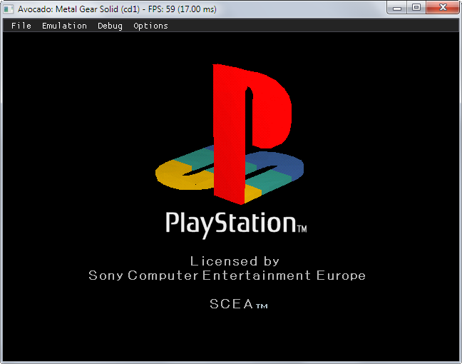

# Avocado
A Modern Playstation 1 emulator.

<p align="center">
    
</p>

If you have any questions just catch me on Twitter ([@JaCzekanski](https://twitter.com/JaCzekanski)) or create an [Issue](https://github.com/JaCzekanski/Avocado/issues). There is also [Discord server](https://discord.gg/ATEJApR).

## Changelog

*9.11.2018* - XA-ADPCM (streaming audio) and Red Book audio support - music should play in most games, SPU samples interpolation (sounds less harsh), Pitch modulation support (used by few games), refactored CDROM reading and cue parsing subsystems, various fixes, hardware (OpenGL) rendering

*27.08.2018* - Support for digital controller, DualShock (without vibrations) and mouse. Two controllers are supported (no multitap for now)

*19.08.2018* - Memory card support

*11.08.2018* - Partial SPU implementation - sound working

## Status

Build   | Status | Download
--------|--------|---------
Travis CI (Linux) | [](https://travis-ci.org/JaCzekanski/Avocado)  
AppVeyor (Windows x86) | [](https://ci.appveyor.com/project/JaCzekanski/avocado/branch/develop) | [Windows x86 - develop](https://ci.appveyor.com/api/projects/JaCzekanski/avocado/artifacts/avocado.zip?branch=develop&job=Environment%3A+TOOLSET%3Dvs2017%2C+platform%3DWin32)
AppVeyor (Windows x64) | [](https://ci.appveyor.com/project/JaCzekanski/avocado/branch/develop) | [Windows x64 - develop](https://ci.appveyor.com/api/projects/JaCzekanski/avocado/artifacts/avocado.zip?branch=develop&job=Environment%3A+TOOLSET%3Dvs2017%2C+platform%3Dx64)

*Note: x64 build requires [AVX compatible processor](https://en.wikipedia.org/wiki/Advanced_Vector_Extensions#CPUs_with_AVX)*

Despite this emulator being in early development, some 3D games can run. [Game compability list](https://literalmente-game.github.io/compatibility_lists/avocado.html)


Currently audio is hard synced to NTSC (60Hz) (**running PAL games will make audio stutter**), MDEC is missing (**black screen instead of movies**). The timer implementation does not function properly (**games fail to boot** or run at wrong speed). Many games won't boot or crash shortly after booting.

## Running

Avocado requires the BIOS from real console in the data/bios directory.
Selection of a BIOS rom will be required on the first run. The rom can be changed under Options->BIOS or by modifying the **config.json** file.

Avocado doesn't support fast booting. [UniROM](http://www.psxdev.net/forum/viewtopic.php?t=722) can be used as a work around. Place the .rom file in the data/bios directory and modify **config.json**:
```
"extension": "data/bios/unirom_caetlaNTSC_plugin.rom"
```

Press the **Start** button (Enter by default) to fastboot, or **R2** (keypad *) to slowboot a game.
You can run the included Playstation firmware replacement *Caetla* with the **Select** button (Right shift) then run the .exe directly from the disk.

To load a .cue/.bin/.img file just drag and drop it.

## Controls

- **Space** - pause/resume emulation
- **F1** - hide GUI
- **F2** - soft reset
- **Shift-F2** - hard reset
- **F7** - single frame
- **Tab** - disable framelimiting
- **Q** - toggle full VRAM preview

Configure controls under Options->Controller menu.

## Build

Requirements (Windows):
- Visual Studio 2017
- [Premake5](https://premake.github.io/download.html)
- [SDL2 dev library](https://www.libsdl.org/download-2.0.php)

```
> git clone https://github.com/JaCzekanski/Avocado.git
> cd avocado
> git submodule update --init --recursive
> premake5 vs2017

# Open Visual Studio solution and build it
```

See appveyor.yml in case of problems.

## Bugs

Use [GitHub issue tracker](https://github.com/JaCzekanski/Avocado/issues) to file bugs. Please attach [Game ID](http://redump.org/discs/system/psx/), screenshots/video, BIOS and build version.

See [Game compability list](https://github.com/JaCzekanski/Avocado/wiki/Compability) before creating a bug issue.
