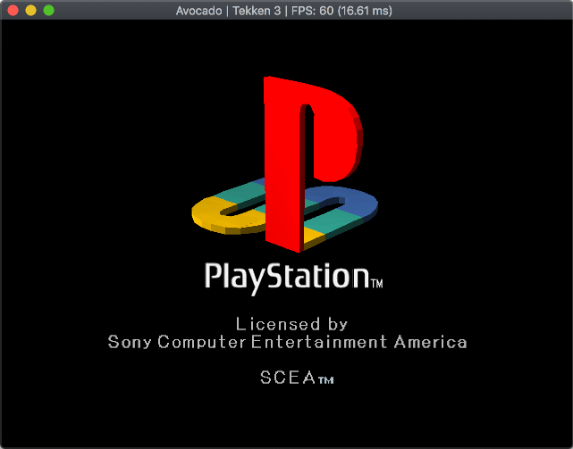
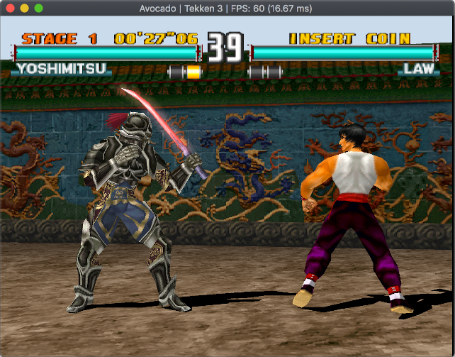
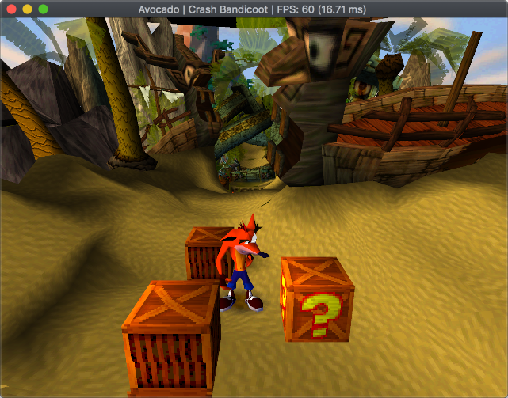
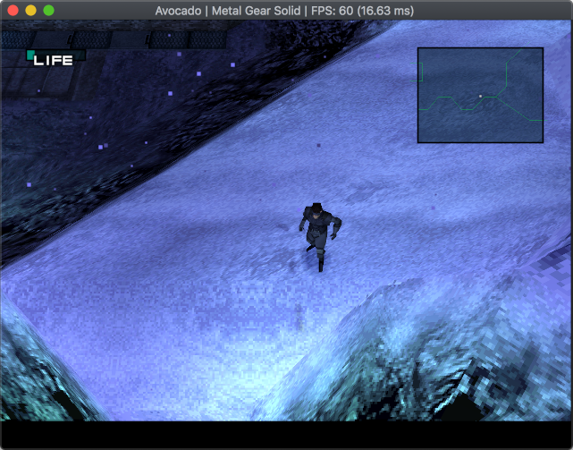

# Avocado
A Modern Playstation 1 emulator.

<p align="center">
    
    
    
    
</p>

If you have any questions just catch me on Twitter ([@JaCzekanski](https://twitter.com/JaCzekanski)) or create an [Issue](https://github.com/JaCzekanski/Avocado/issues). There is also [Discord server](https://discord.gg/ATEJApR).

## Compatibility

See [Avocado compatibility list](https://avocado-db.czekanski.info)

## Changelog

*28.06.2020* - .ecm format support

*16.09.2019* - Save states

*5.09.2019* - Vibration support

*2.09.2019* - Anti-Modchip and LibCrypt protected games support

*13.03.2019* - merged MDEC (video decoder) support

*8.12.2018* - created Compatibility list webapp

*19.11.2018* - added .chd file support

*9.11.2018* - XA-ADPCM (streaming audio) and Red Book audio support - music should play in most games, SPU samples interpolation (sounds less harsh), Pitch modulation support (used by few games), refactored CDROM reading and cue parsing subsystems, various fixes, hardware (OpenGL) rendering

*27.08.2018* - Support for digital controller, DualShock (without vibrations) and mouse. Two controllers are supported (no multitap for now)

*19.08.2018* - Memory card support

*11.08.2018* - Partial SPU implementation - sound working

## Status

Full list: [Avocado Builds](https://avocado-builds.czekanski.info)

Build   | Status | Download
--------|--------|---------
Linux | [](https://travis-ci.org/JaCzekanski/Avocado) | [develop](https://avocado-builds.czekanski.info/latest/linux64)
macOS | [](https://travis-ci.org/JaCzekanski/Avocado) | [develop](https://avocado-builds.czekanski.info/latest/macos)
Android | [](https://travis-ci.org/JaCzekanski/Avocado) | [develop](https://avocado-builds.czekanski.info/latest/android)
Windows 64-bit, Visual Studio 2019 | [](https://ci.appveyor.com/project/JaCzekanski/avocado/branch/develop) | **[develop](https://avocado-builds.czekanski.info/latest/windows64)**
Windows 32-bit, Visual Studio 2019 | [](https://ci.appveyor.com/project/JaCzekanski/avocado/branch/develop) | [develop](https://avocado-builds.czekanski.info/latest/windows32)
Windows 64-bit, Visual Studio 2017 | [](https://ci.appveyor.com/project/JaCzekanski/avocado/branch/develop) |
Windows 32-bit, Visual Studio 2017 | [](https://ci.appveyor.com/project/JaCzekanski/avocado/branch/develop) |

Despite this emulator being in early development, some 3D games can run. [Game compatibility list](https://avocado-db.czekanski.info)


Currently audio is hard synced to NTSC (60Hz) (**running PAL games will make audio stutter**). The timer implementation does not function properly (**games fail to boot** or run at wrong speed). Many games won't boot or crash shortly after booting.

## Requirements
- OS: Windows 7 or later, macOS 10.13 or later, Linux (Ubuntu 16.04 or later)
- GPU: Graphics card supporting **OpenGL 3.1**
- CPU: [SSE3 compatible (CPUs after 2004)](https://en.wikipedia.org/wiki/SSE3#CPUs_with_SSE3) x64 or x86 processor

### Notes
Avocado focuses on supporting relatively modern hardware (2010 and forwards) and non-legacy OSes. 

Emulator is currently single-threaded - if you have multicore CPU you will not benefit from it. Single thread performance is what really matters.

Currently Avocado requires OpenGL 3.1. In the future this limitation will be lifted for software rendering.

## Running

Avocado requires the BIOS from real console in the `data/bios` directory. (use `File->Open Avocado directory` to locate the directory on your system)
Selection of a BIOS rom will be required on the first run. The rom can be changed under `Options->BIOS` or by modifying the **config.json** file.

To load a `.cue/.bin/.img/.chd/.ecm` or `.exe/.psexe/.psf/.minipsf` file just drag and drop it.

PAL games with LibCrypt protection need additional subchannel info - download proper file `.SBI` or `.LSD` file from [Redump](http://redump.org/discs/system/psx/), place it in the same folder as game image and make sure has identical name as `.cue/.bin/...` file.

## Controls

- **Space** - pause/resume emulation
- **F1** - hide GUI
- **F2** - soft reset
- **Shift-F2** - hard reset
- **F5** - quick save
- **F7** - quick load
- **Tab** - disable framelimiting
- **Backspace** - rewind one second

Configure controls under Options->Controller menu.

## Build


### Windows
Requirements:
- Visual Studio 2019 (2017 should work as well)
- [Premake5](https://premake.github.io/download.html)

First build: 
```
git clone --recursive https://github.com/JaCzekanski/Avocado.git
cd Avocado
premake5 vs2019

# Open avocado.sln with Visual Studio, make sure that Release build is selected, build it
```

See appveyor.yml in case of problems.

Update:
```
git pull && git submodule update --init --recursive
premake5 vs2019

# Open avocado.sln, build it
```

### Linux
Requirements:
- Clang6 or newer
- [Premake5](https://premake.github.io/download.html)

First build: 
```
sudo apt update
sudo apt install libsdl2-dev
git clone --recursive https://github.com/JaCzekanski/Avocado.git
cd Avocado
premake5 gmake
make config=release_x64 -j4

# Running
./build/release_x64/avocado
```

See .travis/linux/build.sh in case of problems.

Update:
```
git pull && git submodule update --init --recursive
premake5 gmake
make config=release_x64 -j4
```

### macOS
Requirements:
- XCode
- [Premake5](https://premake.github.io/download.html)
- [Brew](https://brew.sh)

First build:
```
brew update
brew install sdl2
git clone --recursive https://github.com/JaCzekanski/Avocado.git
cd Avocado
premake5 gmake
make config=release_x64 -j4

# Running
./build/release_x64/avocado.app
```

See .travis/macos/build.sh in case of problems.

Update:
```
git pull && git submodule update --init --recursive
premake5 gmake
make config=release_x64 -j4
```

## Bugs

Use [GitHub issue tracker](https://github.com/JaCzekanski/Avocado/issues) to file bugs. Please attach [Game ID](http://redump.org/discs/system/psx/), screenshots/video, BIOS and build version.

See [Game compatibility list](https://avocado-db.czekanski.info) before creating a bug issue.
