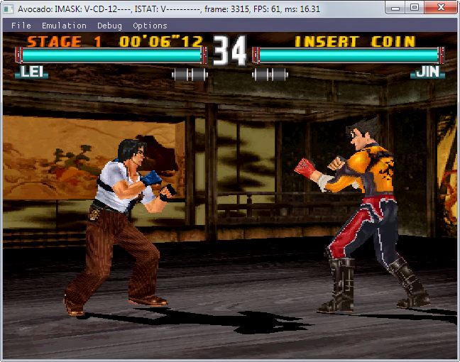
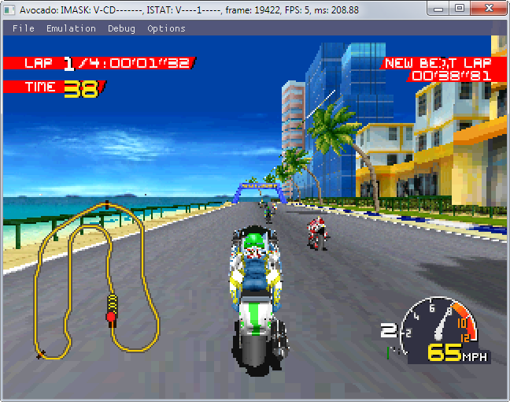
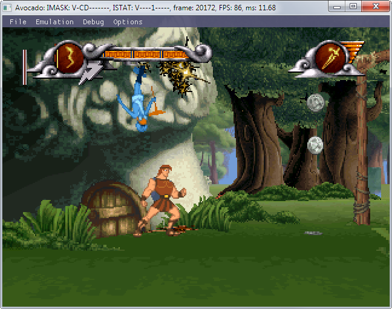
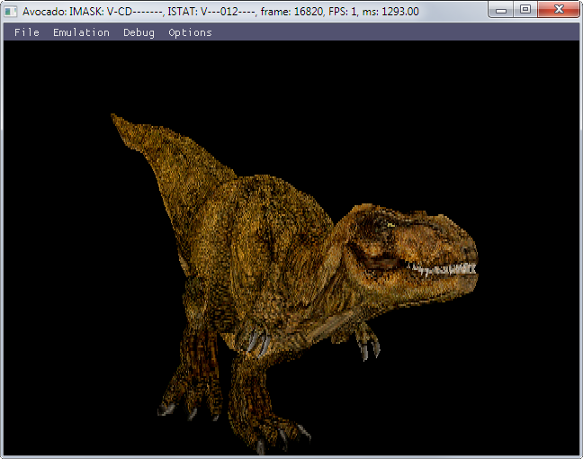

# Avocado 
Modern Playstation 1 emulator project.

Build   | Status | Download (develop) 
--------|--------|-------------------
Travis CI (Linux) |  | 
AppVeyor (Windows) |  | [Windows - develop](https://ci.appveyor.com/api/projects/JaCzekanski/avocado/artifacts/avocado.zip?branch=develop&job=Environment%3A+TOOLSET%3Dvs2017)

Few games/demos are working correctly:

